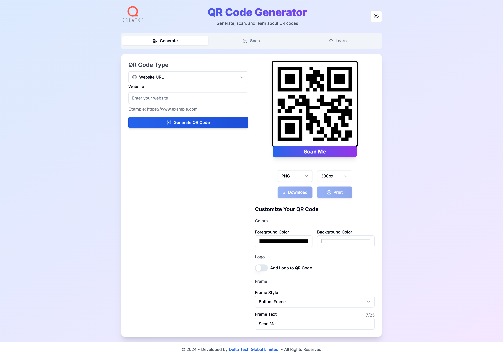

# QR Code Generator

A modern, feature-rich QR code generator built with Next.js and TypeScript. Create customized QR codes for various purposes with an intuitive user interface.



## Features

### Multiple QR Code Types
- **vCard Contact**: Create QR codes for contact information
- **WiFi Network**: Share WiFi credentials securely
- **Social Profile**: Link to social media profiles
- **App Store Links**: Direct links to apps across different stores
- **Website URL**: Quick access to websites
- **SMS Message**: Generate SMS QR codes
- **Phone Number**: Quick dial QR codes
- **Email Address**: Direct email QR codes
- **Location**: Share geographical coordinates
- **Plain Text**: Encode any text message

### Customization Options
- Custom colors for QR code and background
- Multiple frame styles
- Customizable frame labels
- Logo insertion capability
- Adjustable frame label position

## Tech Stack

- **Framework**: Next.js 14
- **Language**: TypeScript
- **Styling**: Tailwind CSS
- **UI Components**: 
  - Radix UI
  - Shadcn UI
  - Lucide Icons
- **QR Code**: qrcode.react
- **Theme**: Dark/Light mode support

## Getting Started

### Prerequisites
- Node.js 18+ 
- Yarn package manager

### Installation

1. Clone the repository:
```bash
git clone https://github.com/yourusername/qr-code-generator.git
cd qr-code-generator
```

2. Install dependencies:
```bash
yarn install
```

3. Start the development server:
```bash
yarn dev
```

4. Open [http://localhost:3000](http://localhost:3000) in your browser

### Building for Production

```bash
yarn build
```

- ### Deployment
+ ### Deployment to GitHub Pages
```bash
yarn deploy
```

## Usage

1. Select a QR code type from the dropdown menu
2. Fill in the required information
3. Customize the appearance using the options panel
4. Download your QR code as PNG

## Features in Detail

### vCard Contact QR Code
- Full contact information support
- Professional formatting
- Compatible with most QR code scanners

### WiFi Network QR Code
- Supports WPA/WPA2, WEP, and open networks
- Hidden network option
- Secure password handling

### App Store Links
- Support for multiple app stores:
  - Apple App Store
  - Google Play Store
  - Amazon Appstore
  - Chrome Web Store

## Contributing

Contributions are welcome! Please feel free to submit a Pull Request.

1. Fork the repository
2. Create your feature branch (`git checkout -b feature/AmazingFeature`)
3. Commit your changes (`git commit -m 'Add some AmazingFeature'`)
4. Push to the branch (`git push origin feature/AmazingFeature`)
5. Open a Pull Request

## License

This project is licensed under the MIT License - see the [LICENSE](LICENSE) file for details.

## Acknowledgments

- [Next.js](https://nextjs.org/)
- [Tailwind CSS](https://tailwindcss.com/)
- [Radix UI](https://www.radix-ui.com/)
- [Shadcn UI](https://ui.shadcn.com/)
- [QRCode.react](https://github.com/zpao/qrcode.react)

## Contact

Your Name - [@yourtwitter](https://twitter.com/yourtwitter)

Project Link: [https://github.com/yourusername/qr-code-generator](https://github.com/yourusername/qr-code-generator)